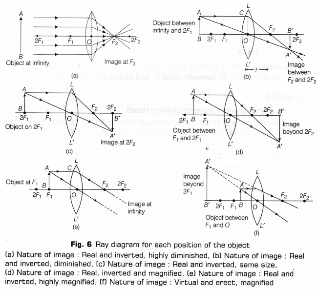
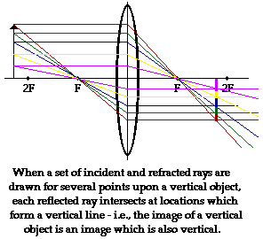
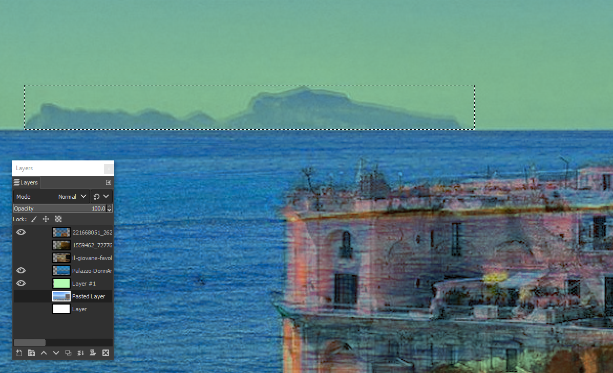
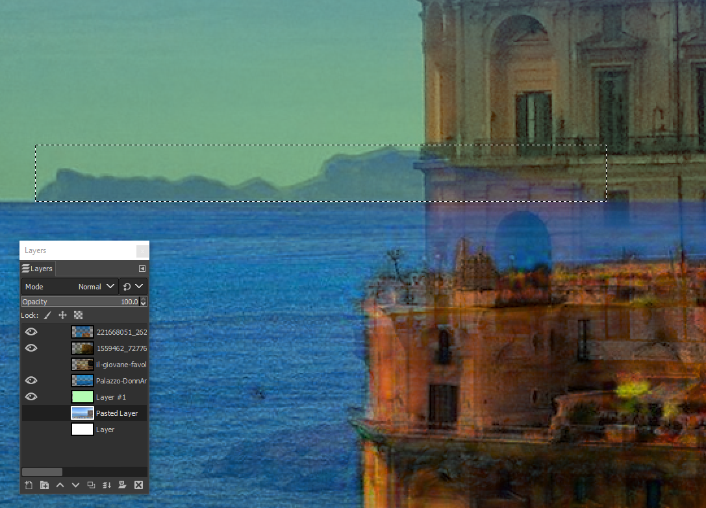
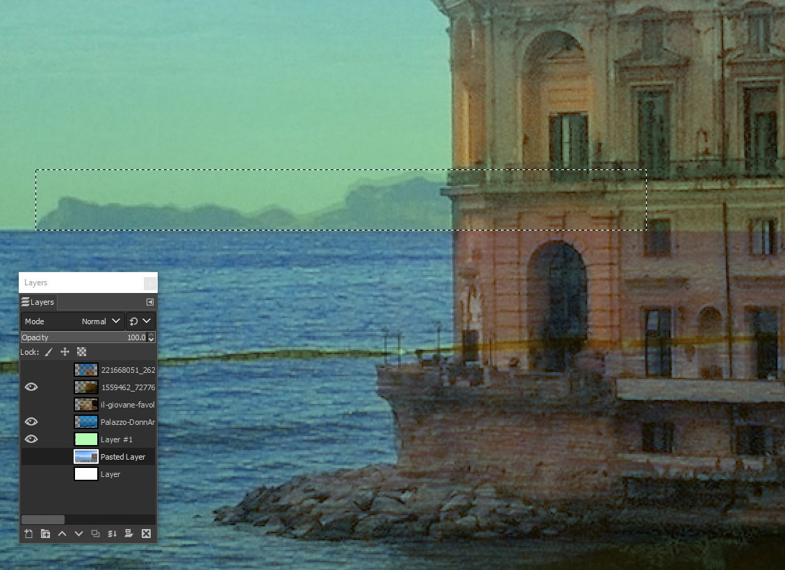
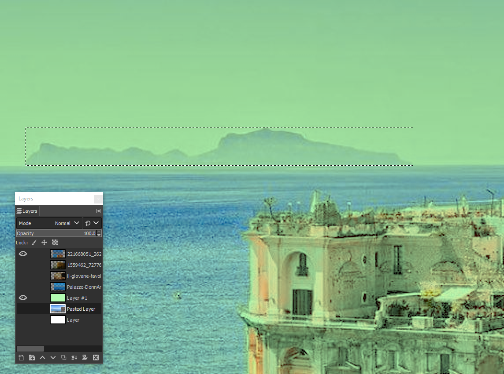
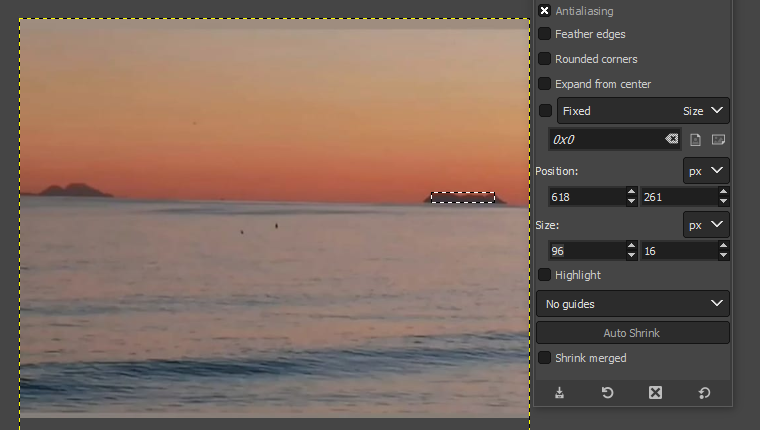

# Perspective-Illusion
Explaining why you see an imaginary horizon on a fckng FLAT Earth ..

here we go .. Little Blue Ball DEBUNKED ..
### First of All , you have to unlearn most of BUL$HIT the may have teach you about light 
  
  

despite (almost certainly) you did learn about vision following some of above BULLSHIT ..  
Light does't really work like that **YEP** NO MISTAKE !!  

I did never understand how it can be possible they teach you light works this way which just doesn't make sense AT ALL .. 

so let make this clear once and for all first ..  

##### in just one sentence will be , lenses DO NOT BEND/DEVIATE LIGHT .. nothing really can do it ..  

but , even more funny, PARALEL RAYS concept is just plain silly to start with , loved by math ppl but has nothing to do with vision  
you are lucky Light is smarter than humans are cause otherwise you won't have any vision toy given human understanding of it **LOL**  

thing is .. Light can only be REFLECTED in any case, which is not a simple detail as may seem ..
however without get too deep here into details of this ,,  
let's just DEBUNK the myth of paralel rays which is plain silly and you can easily understand it   
(while I can't really stand it since child !!)  
if it was true the bullshit about paralel light rays,  
**then,, you'll be only able to see , just as much of the world as the lens size (your pupil size LOL) in front of you, period. !!**  
which is obviously not the case .. isn't ?  

### Simplified Vision concept ..

without go deep into more sophisticated scenarious, let's do it the Math-PPL way ..
we start with a very simplified one, just not so simple as Math people usually like to ..  
the focus to infinity is the most simplified scenario , however is just a very exceptional scenario ..  
and you have to keep this really in mind , but even more important  
not ASSUME this as base for your math in vision ..  
it's very important to understand that ,  
focus in general and focus to infinity are just a little part of vision process   
just what needed to let you see in first place !!   
then, what's really going on at least in human vision is way more complicated ..  
while you don't even notice how much processing your brain is actually doing   
photo cameras uses just same principle, 
however, just miraculously, it works despite humans don't really understand how it really does .. **LOL**  

so,here I'll try to explain the most relevant part, in the proces which is also really not understood at all, Perspective ..   
not talking about overall perspective , but .. general interleaved/fractal perspective which effectivelly change what you see ..  
and specially what you measure .. given you math does't account at all for it ..  
while this only make sense and it's correct, in 1 in infinite cases ..  

# Examples ..

